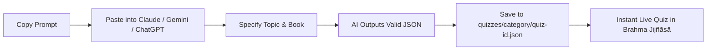

# Brahma Jijñāsā — Master Quiz Generation Prompt System

This directory contains master system prompts for generating high-quality, scripturally authentic quizzes for the **Brahma Jijñāsā** platform.

The outputs generated by these prompts directly match the TypeScript schema defined in [`src/types/quiz.ts`](../../src/types/quiz.ts) and can be saved directly as `.json` files under `quizzes/<category>/<quiz-id>.json`.

---

## Available Prompts

1. [**`notebooklm-quiz-prompt.md`**](./notebooklm-quiz-prompt.md) ⭐ **(Primary / Recommended)**
   - **Tuned specifically for Google NotebookLM** based on your uploaded PDFs, Docs, and books.
   - Instructs NotebookLM to ground questions strictly in your source documents, extract subtle details and ācārya purports, and output valid schema JSON.
   - Includes tips for source grounding and 2-step batching (Q1–Q10, Q11–Q20).

2. [**`shrimad-bhagavatam-quiz-prompt.md`**](./shrimad-bhagavatam-quiz-prompt.md) ⭐
   - **Tuned specifically for Śrīmad-Bhāgavatam** in Google NotebookLM.
   - Includes a flexible `[SCOPE]` parameter: easily switch between a generic comprehensive quiz or focus on specific cantos/pastimes (Dhruva, Prahlāda, Gajendra, Dāmodara, Ajāmila, etc.).

3. [**`mahabharata-20q-prompt.md`**](./mahabharata-20q-prompt.md)
   - Turnkey, comprehensive prompt specifically for the **Mahābhārata**.
   - Spans the 18 Parvas with rich character studies, Dharmic dilemmas, subtle narrative details, and philosophical dialogues.

4. [**`master-quiz-prompt.md`**](./master-quiz-prompt.md)
   - Universal prompt for **any Vedic text**: Mahābhārata, Śrīmad-Bhāgavatam, Bhagavad-gītā, Rāmāyaṇa, Upaniṣads, Caitanya-caritāmṛta, etc.
   - Configurable for specific commentators (Śrīla Prabhupāda, Śrī Rāmānujācārya, Śrī Madhvācārya, Śrīla Viśvanātha Cakravartī Ṭhākura, Śrīla Baladeva Vidyābhūṣaṇa, Śrī Śaṅkarācārya).

---

## How to Use These Prompts

1. Open [`master-quiz-prompt.md`](./master-quiz-prompt.md) or [`mahabharata-20q-prompt.md`](./mahabharata-20q-prompt.md).
2. Copy the entire prompt into **Gemini 1.5 Pro / Claude 3.5 Sonnet / ChatGPT**.
3. (Optional) Customize the target topic, parva/canto, or commentator.
4. Copy the JSON output.
5. Create a new file, e.g. `quizzes/mahabharata/kurukshetra-heroes.json`, and paste the JSON.
6. The quiz immediately appears on the platform!
